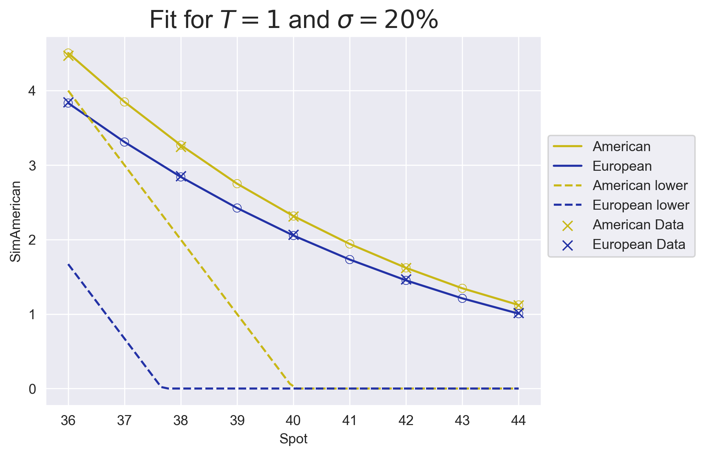
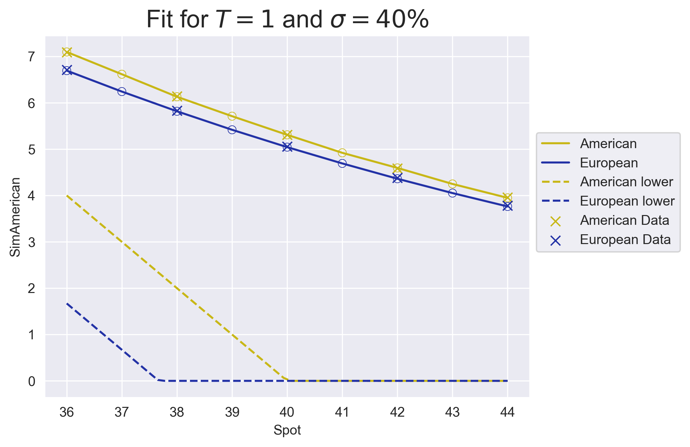
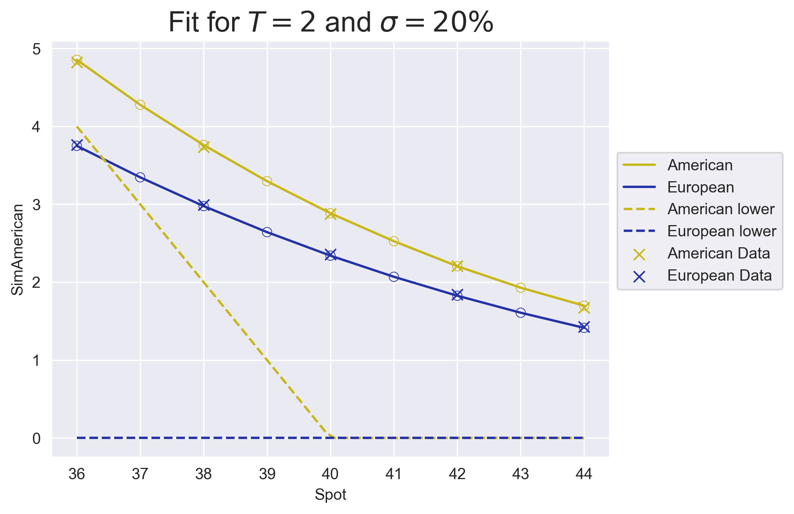
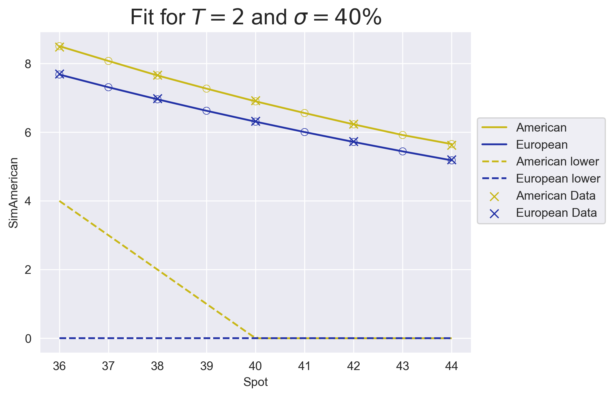

Follows the algorithm in Longstaff--Schwarz, see for example:

https://people.math.ethz.ch/~hjfurrer/teaching/LongstaffSchwartzAmericanOptionsLeastSquareMonteCarlo.pdf

Uses non-parametric regression to estimate the continuation value.

_Note_. Data (file=`data.csv`) is taken from the original paper of Longstaff and Schwarz. Fit to data is very good.

